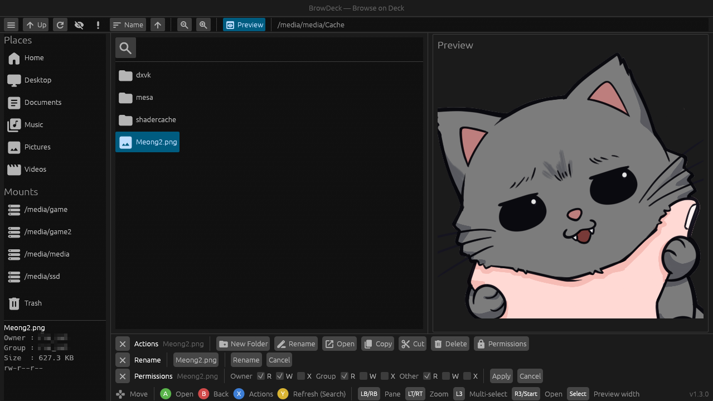

# BrowDeck

A gamepad-first file browser for Linux, built for Steam gamemode / gamescope.

## Description

Most file browsers assume a mouse and keyboard. BrowDeck doesn't — every
action (navigate, select, copy/cut/delete, extract, change permissions) is
reachable from a controller alone, with no nested right-click menus.
Fullscreen by default at the display's native resolution, so it behaves
correctly under gamescope instead of rendering at some fallback resolution
and getting blurred.

## Features

- Full gamepad navigation — d-pad/stick movement stays confined to whichever
  pane (sidebar, file list, actions/preview, toolbar) is focused; LB/RB
  switches between panes
- Copy, cut, delete (to trash), extract (`.zip`/`.tar`/`.tar.gz`/`.tgz`),
  rename/new folder, and change permissions (single file or a whole
  multi-selection at once), all from a button-driven actions panel
- Multi-select for batch operations
- Sidebar: XDG places (Home/Desktop/Documents/…), real block-device mounts
  with USB/microSD detection, a trash view with restore/empty, and an info
  card (owner/group/size/permissions/link target) for the current selection
- Sort the file list by name, size, or modified date, ascending or
  descending
- Mimetype-aware file icons (archives, images, audio, video, PDFs, code,
  fonts, …), not just generic file/folder icons
- Quick preview pane for images and text files
- Show/hide hidden files toggle (hidden by default)
- In-folder search, with an optional recursive (subfolder) mode
- Material Design icons; LT/RT adjusts the scale of the sidebar and main
  pane specifically (toolbar/strip/preview stay a fixed size)
- CJK (Japanese/Chinese/Korean) filename rendering
- Hold Start for 3s to quit, with a Yes/Cancel confirmation — no keyboard
  Alt+F4 to rely on under gamescope/Game Mode
- Optional IProLaunch integration — an "Add to IProLaunch" action appears
  for `.exe`/`.bat` files when IProLaunch is installed

## Installation

Grab the latest release from the
[Releases page](https://github.com/krakerz/BrowDeck/releases), extract the
`.tar.gz`, then run `./install.sh` (`./uninstall.sh` to remove it later) —
see the bundled `INSTALL.txt`.

Or build from source (below).

## Building from source

Requires a recent stable Rust toolchain (2024 edition).

```sh
git clone <this-repo>
cd BrowDeck
cargo build --release
./target/release/browdeck
```

BrowDeck writes `$XDG_CONFIG_HOME/browdeck/config.toml` (falling back to
`~/.config/browdeck/config.toml`) itself the first time it runs with none
present, with sane defaults already set — fullscreen at the display's
native resolution, and a thin title header above the toolbar (there to
keep the toolbar's icons clear of Steam/gamescope's own performance
overlay) both on. Edit it to go windowed, change the resolution, or turn
the header off; see `config/config.example.toml` for every available key.

## Usage

Navigate with the d-pad or left stick; the right stick moves the selection
(or scrolls, in Preview) faster. Gamepad button reference:

| Button    | Action                                    |
|-----------|--------------------------------------------|
| A         | Activate (open/select focused item)         |
| B         | Back — close a menu, or go up a directory   |
| X         | Actions — select the focused item and open the actions panel |
| Y (tap)   | Refresh the active pane                     |
| Y (hold)  | Search                                      |
| L3        | Toggle multi-select                         |
| R3        | Open the selected item                      |
| Start (tap)  | Open the selected item                   |
| Start (hold) | Quit (asks for Yes/Cancel confirmation)  |
| Select    | Toggle preview pane width                   |
| LB / RB   | Switch pane (Sidebar / main list / Preview / Toolbar) |
| LT / RT   | Icon scale down / up                        |

Everything is also reachable with a mouse and keyboard.

## FAQ

**Why fullscreen by default?**
Because rendering at a fallback resolution and letting the compositor
upscale/blur the result is the exact gamescope behavior this project exists
to avoid.

**Does it work without a gamepad?**
Yes — mouse and keyboard work throughout. The status bar's button legend
always shows, connected or not, since it doubles as a reference for the
mouse/keyboard equivalents.

**Does it follow symlinks?**
Directory listings and navigation follow symlinks; the recursive search
does not descend into symlinked directories, to avoid loops.

**How does the IProLaunch integration work?**
At startup, BrowDeck reads `~/.config/iprolaunch/bin-path` (a config file
whose contents are the path to the
[IProLaunch](https://github.com/krakerz/IProLaunch) CLI binary) and
checks that the binary it points to exists. If so, selecting an
`.exe`/`.bat` file and opening the actions panel shows an "Add to
IProLaunch" button, which runs that binary with
`add <absolute path to the selected file>`. If the file's already a
registered library profile (checked via `library search`), the button
shows a checkmark and is disabled instead.

---

### Notes

Built and maintained with the help of AI.
